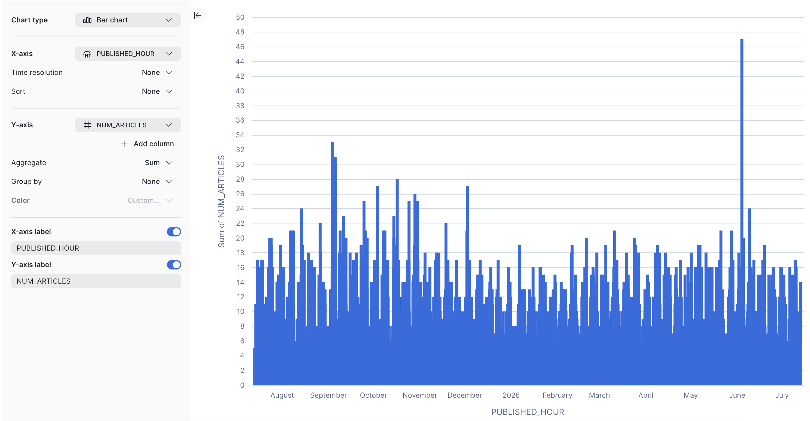
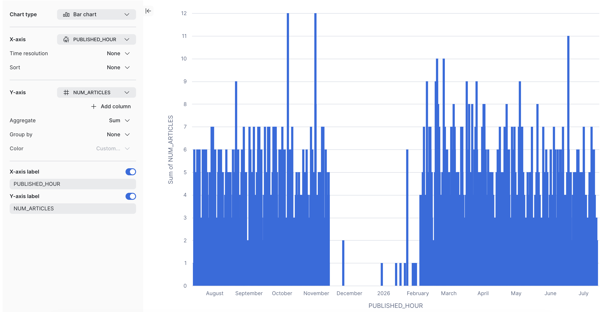

## Load Estimation
### Max # of articles posted in one day by:
- The Globe: 285
- BDC: 60
### Max # of articles posted in one hour by:
- The Globe: 47 
- BDC: 12 
### Median # of articles posted daily:
- The Globe: 70
- BDC: 27
### Median # of articles posted in one hour between 8am and 8pm EST:
- The Globe: 6
- BDC: 2
- STAT: ? 

## Load Testing Methodology:
### Baseline load
	- 20 articles/hr
	- Median word count: 708 words
### Stress test
	- 100 articles/hr
	- Max word count: 51,000 words
### Spike test
	- 5 articles/min for 5 minutes
	- Median word count: 708 words

# API Load and Stress Testing Plan

## Scope

This plan covers two QA endpoints:
  
- `POST /v1/audio/speech`

- `GET /v1/download/{filename}`

The goal is to understand current system behavior under realistic and extreme load, not to validate a final SLA yet.
## Assumptions

- Testing happens against a QA environment.
- `POST /v1/audio/speech` is synchronous and returns a streaming response.
- There is currently no auth, rate limiting, or request size enforcement.
- `GET /v1/download/{filename}` should be exercised using files that were previously created by the POST flow.

## Production-Informed Workload Model

Use the historical article volume to shape the test load:

- Median published articles per day: `125`
- Peak published articles per day: `400`
- Peak published articles per hour: `75`
- Typical publishing window: `8am-8pm EST`
- Median article length: `700` words
- Maximum article length observed: `51,000` words

### Interpreting the traffic profile
  
The historical data suggests a relatively low daily median with bursts during business hours. The load plan should therefore include:

- A baseline period that matches the typical 12-hour publishing window
- A realistic burst level near the observed hourly maximum
- A stress level above the historical peak to expose failure modes

## Article size bands

Use a weighted article corpus so the tests reflect real usage:

- Small: `300-900` words, weighted heavily around the median
- Medium: `901-5,000` words
- Large: `5,001-15,000` words
- Extreme: `15,001-51,000` words

Suggested baseline mix:
  
- 65% small
- 20% medium
- 10% large
- 5% extreme

This mix keeps the test grounded in the median while still surfacing issues caused by unusually large articles.

## Endpoint-Specific Scenarios

### POST `/v1/audio/speech`

Test dimensions:

- Small, medium, large, and extreme article payloads
- Streaming response behavior under concurrency

### GET `/v1/download/{filename}`

Test dimensions:
- Retrieval of small, medium, large, and extreme files

## Siege Execution Pattern

Use separate test files or URL lists for each scenario.
### POST-only run

Use a request body file with representative article texts and run Siege against `POST /v1/audio/speech`.

### GET-only run

Use a file list of generated filenames and run Siege against `GET /v1/download/{filename}`.

### Mixed run

Run a Siege job with both POST and GET requests.

## Expected Outcomes

This testing should help us determine:

- Practical concurrency limits

- Payload-size sensitivity

- Whether the streaming POST endpoint becomes the bottleneck

- Whether file creation and download throughput stay in sync

- Where rate limits and request-size limits should eventually be set
